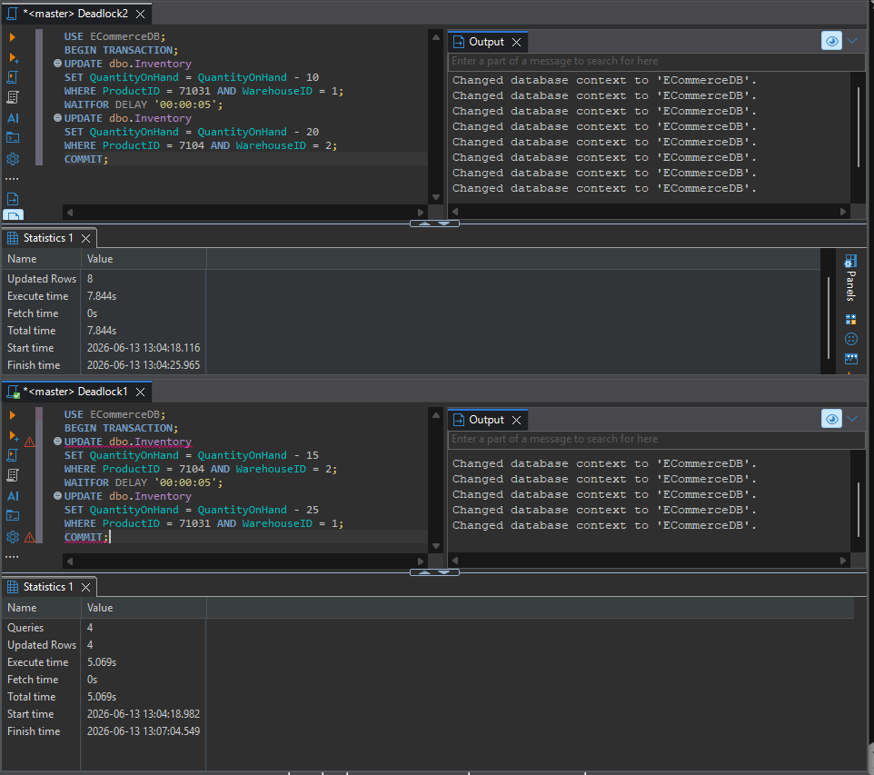
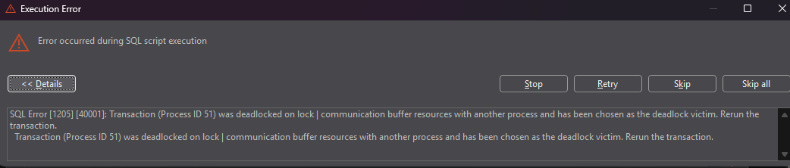
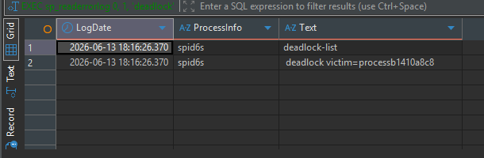

# Ejercicio 5

# 1. Reproducir el deadlock abriendo 2 sesiones en SSMS/ADS

### Codígos usados para generar el Deadlock

Se abren 2 sesiones separadas en el cliente SQL de su preferencia(en esta demostracion se uso DBeaver), pega en cada uno el codigo que esta abajo y los ejecuta al mismo tiempo. 

```sql
USE ECommerceDB;
BEGIN TRANSACTION;
UPDATE dbo.Inventory
SET QuantityOnHand = QuantityOnHand - 10
WHERE ProductID = 71031 AND WarehouseID = 1;
WAITFOR DELAY '00:00:05';
UPDATE dbo.Inventory
SET QuantityOnHand = QuantityOnHand - 20
WHERE ProductID = 7104 AND WarehouseID = 2;
COMMIT;
```

```sql
USE ECommerceDB;
BEGIN TRANSACTION;
UPDATE dbo.Inventory
SET QuantityOnHand = QuantityOnHand - 15
WHERE ProductID = 7104 AND WarehouseID = 2;
WAITFOR DELAY '00:00:05';
UPDATE dbo.Inventory
SET QuantityOnHand = QuantityOnHand - 25
WHERE ProductID = 71031 AND WarehouseID = 1;
COMMIT;
```



Luego de 5 segundos saltara el error y mostrar el Deadlock, el Process ID 51 fue elegido como la víctima del Deadlock.



# 2. Capturar el deadlock graph (trace flag 1222 o Extended Events)



# 3. Proponer al menos 2 soluciones y explicar cuál recomiendas y por que

- Solución 1

**Reglas para realizar cambios en la base de datos**: estas reglas deben seguirse para realizar cualquier cambio a la base de datos. Hacer que los cambios sean de menor a mayor en los ID, por ejemplo: Primero el WarehouseID menor (1), luego el mayor (2), lo mismo en la otra consulta, con esto se evita el Deadlock y no se debe hacer ningún cambio a la infraestructura de la base de datos. 

```sql
BEGIN TRANSACTION;
    UPDATE dbo.Inventory
    SET    QuantityOnHand = QuantityOnHand - 10
    WHERE  ProductID = 71031 AND WarehouseID = 1;  -- W1 primero

    UPDATE dbo.Inventory
    SET    QuantityOnHand = QuantityOnHand - 20
    WHERE  ProductID = 7104 AND WarehouseID = 2;   -- W2 despues
COMMIT;
```

```sql
BEGIN TRANSACTION;
    UPDATE dbo.Inventory
    SET    QuantityOnHand = QuantityOnHand - 25
    WHERE  ProductID = 71031 AND WarehouseID = 1;  -- W1 primero

    UPDATE dbo.Inventory
    SET    QuantityOnHand = QuantityOnHand - 15
    WHERE  ProductID = 7104 AND WarehouseID = 2;   -- W2 despues
COMMIT;
```

- Solución 2

**READ_COMMITTED_SNAPSHOT (RCSI):** Con esta regla se evita que más de una consulta use un mismo valor, haciendo que la primera consulta que lo seleccione haga su cambio y luego es desbloqueada para seguir con la siguiente consulta. 

```sql
ALTER DATABASE ECommerceDB
SET READ_COMMITTED_SNAPSHOT ON;

-- Verificar que este activo 
SELECT name, is_read_committed_snapshot_on
FROM sys.databases
WHERE name = 'ECommerceDB';
```

### ¿Cuál elegiría?

Usaría la opción 1 por ser sencilla y completa, evitando agregar más reglas incensarías que puedan generar mayor costo de computación a la base de datos y ataca el problema desde la raíz.